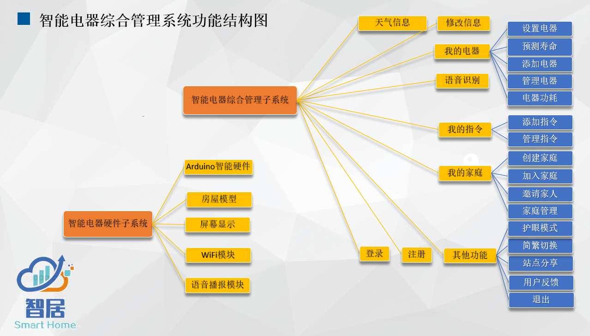
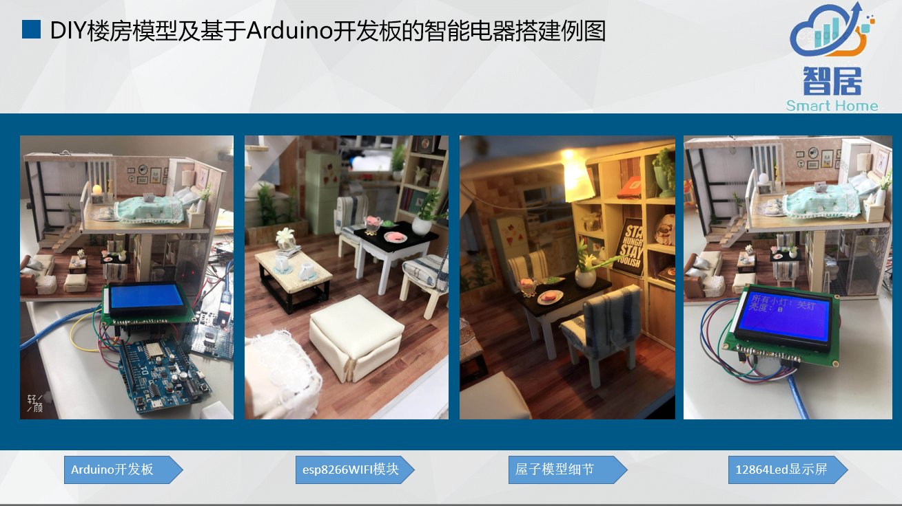
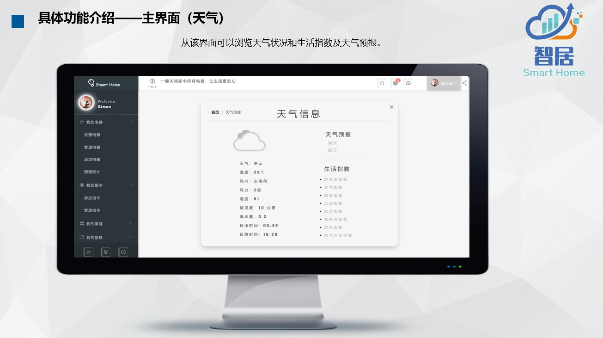
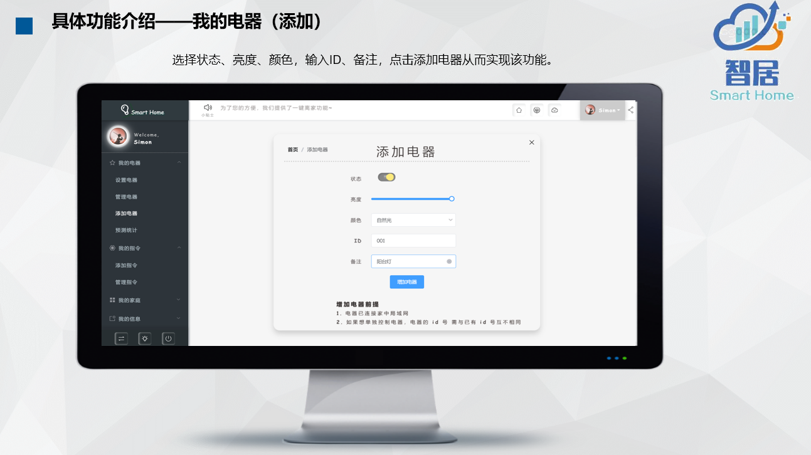
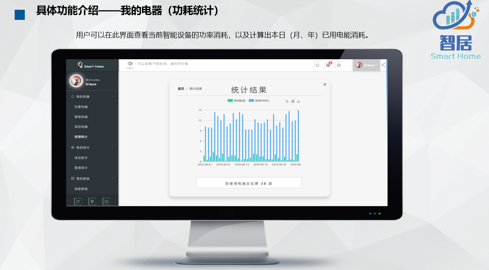
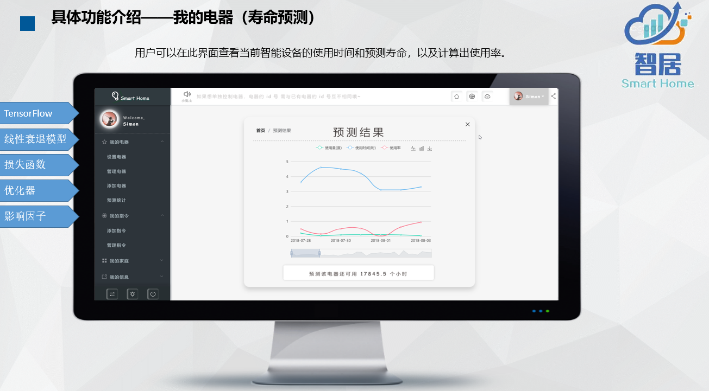
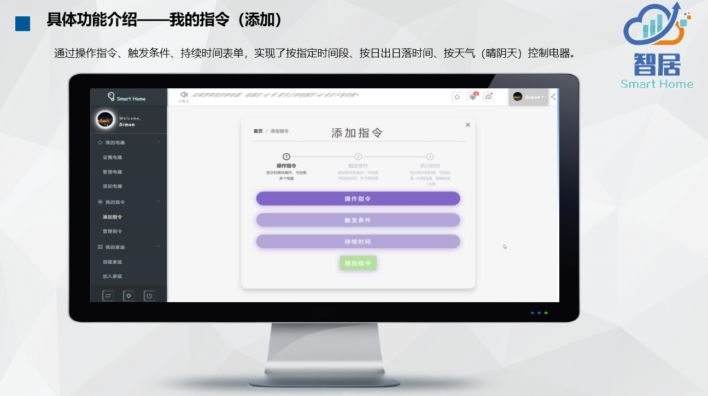
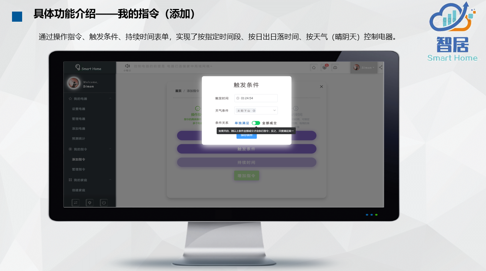
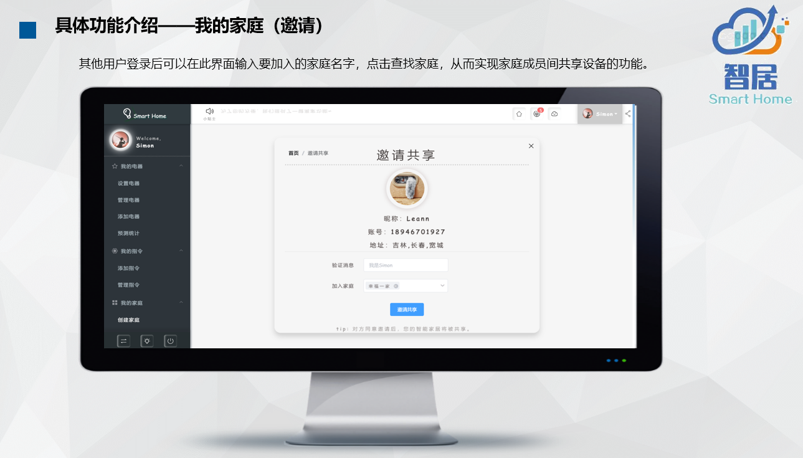

# 智能电器综合管理系统

> 基于第七届中国软件杯 [B3赛题-智能电器综合管理系统](http://www.cnsoftbei.com/bencandy.php?fid=151&aid=1617) 的赛题要求，个人开发的物联网项目。

## 💡项目简介

结合微处理器、传感器、网络通信等技术，开发一套更节能、高效、便捷的智能电器综合管理系统，降低智能硬件的功耗、损耗及成本。

• 物联网设备与云计算相结合实现对设备参数的智能调节；

• 物联网设备需要将自身数据上传至云端，并支持从云端发起的对物联网设备的控制；

• 对设备数据进行采集、归纳与分析，通过人工智能技术进一步优化设备使用策略，并预测未来使用情况。

## 📃系统架构

#### 前端

1. Vue 全家桶
2. Element UI
3. 预处理器: Stylus、Pug
4. Echarts

#### 后端

1. Koa2
2. 监控: fundebug
3. 日志: Log4
4. 定时器: node-schedule

#### 持久化

1. MongoDB
2. DAO: Mongoose

#### 硬件

1. Arduino
2. 12864Led
3. esp8266
4. 语音播报

#### 服务器

1. Nginx（站点服务器）
2. PM2（站点服务器）
3. Nodemon（后端开发热服务器）
4. Mosca(MQTT服务器)

#### 人工智能

Tensorflow

#### 通信

HTTP: Axios

MQTT: Promise + MQTT 通信框架

#### 安全

加密算法: Bcrypt + 二次加盐

## ✨功能介绍

## 🌟安装启动

1. npm install
2. 修改 config 文件夹中 以下配置文件,改成本地
   1. file.json
   2. key.json
   3. db.json
3. 安装 mongodb

1. 开启数据库

  > mongod

2. 开启前端服务器

  > npm run serve

3. 开启后端服务器

  > (建议使用 vscode,并配置 node 服务器)cd server && nodemon

4. 开启文件服务器

  > cd files && nodemon

5. 开启MQTT服务器

  > cd mqtt && nodemon

  

## 🌞协议

LGPL-3.0

